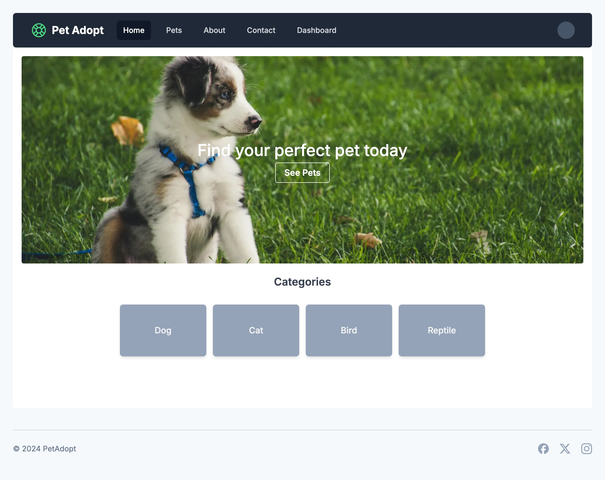
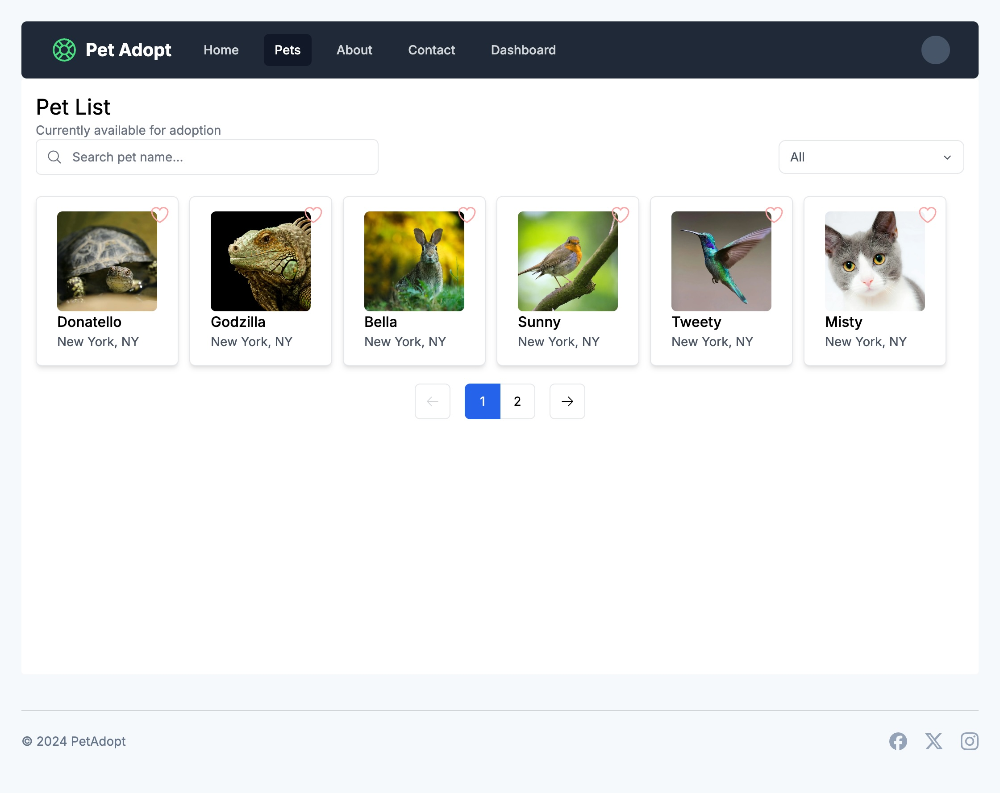
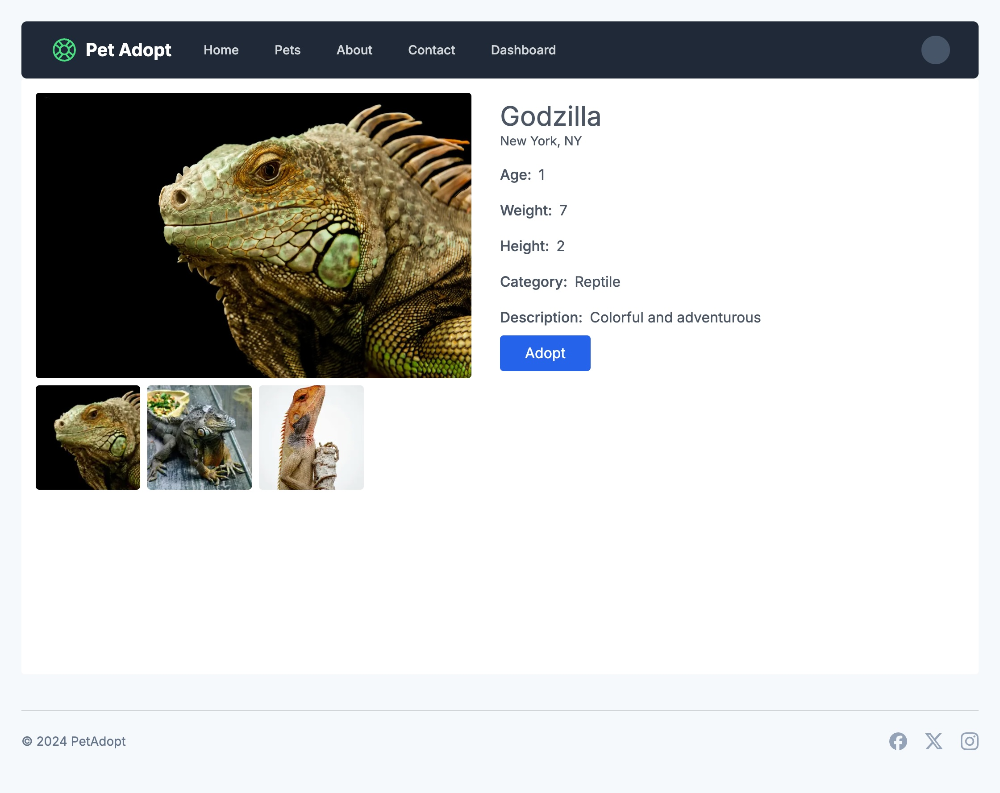
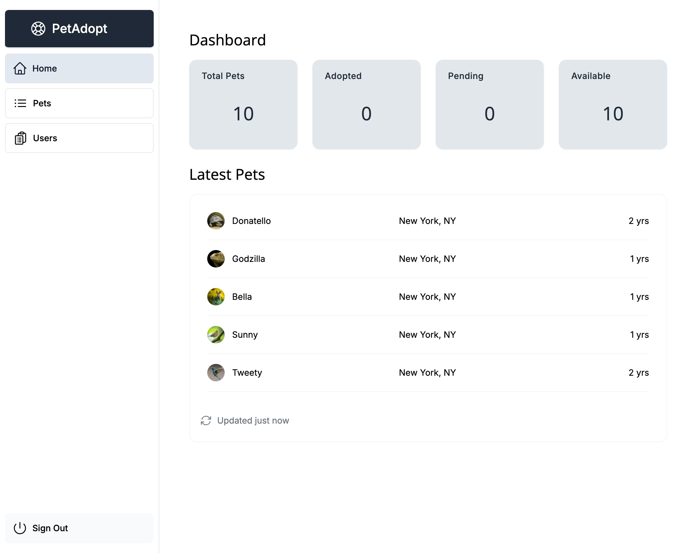
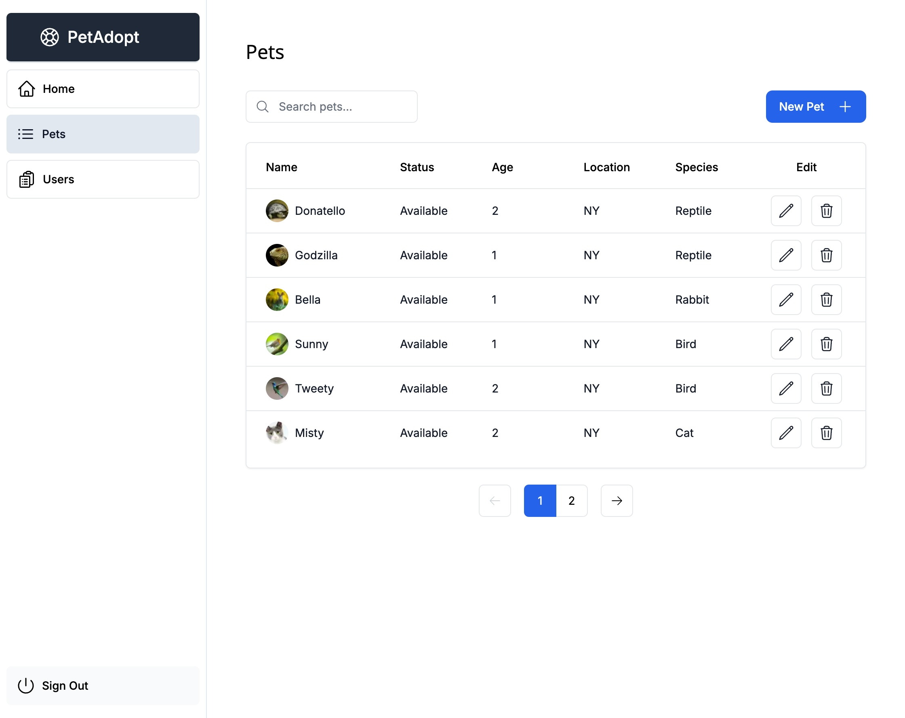
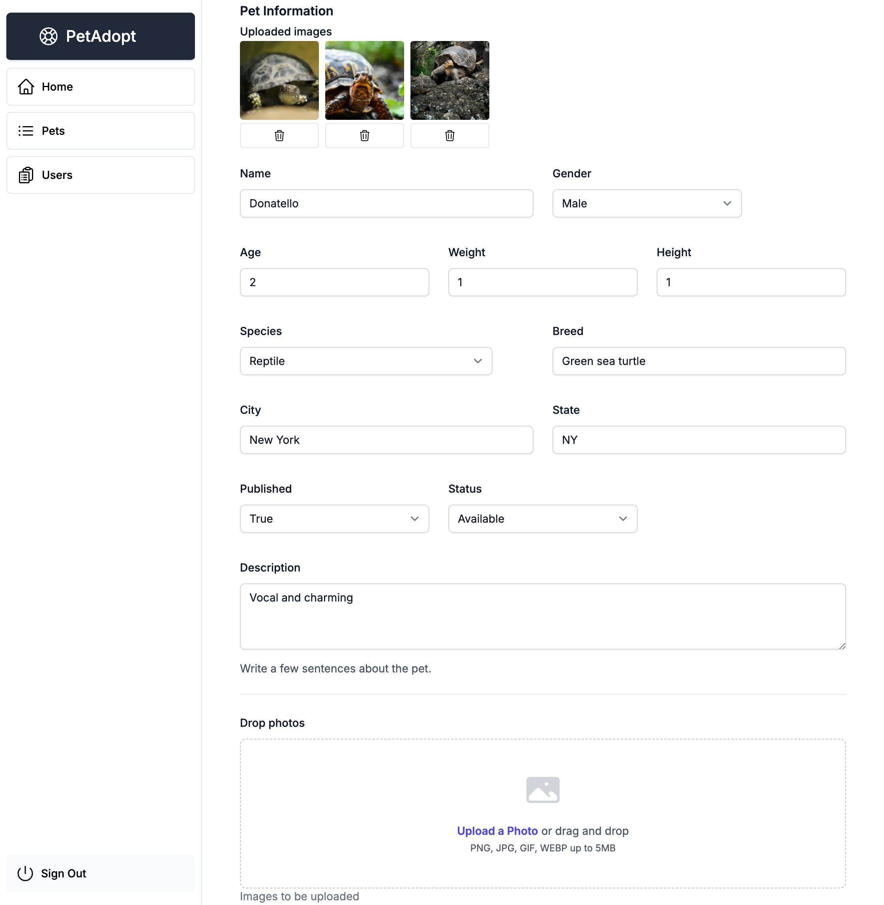

# Animal Shelter Web App

## Project Description

This is an open-source web application designed to help animal shelters manage their operations efficiently. The app provides a user-friendly interface for potential adopters to view available pets and a comprehensive dashboard for employees to manage pet and user information.

## Tech Stack

- **Framework**: Next.js (React)
- **Backend**: Node.js
- **ORM**: Prisma
- **Database**: PostgreSQL
- **Authentication**: Auth.js
- **Containerization**: Docker

## Screenshots

Here are some screenshots of the app:

<a href="public/screenshots/homepage.jpg" target="_blank">
  
</a>
<p><em>Caption: Homepage</em></p>

<a href="public/screenshots/publicPetList.jpg" target="_blank">
  
</a>
<p><em>Caption: Showing available pets for adoption.</em></p>

<a href="public/screenshots/publicPetDetails.jpg" target="_blank">
  
</a>

<p><em>Caption: Showing pet information.</em></p>

<a href="public/screenshots/dashboardHome.jpg" target="_blank">
  
</a>
<p><em>Caption: Admin dashboard homepage.</em></p>

<a href="public/screenshots/dashboardPets.jpg" target="_blank">
  
</a>
<p><em>Caption: Admin dashboard for managing pets.</em></p>

<a href="public/screenshots/dashboardEditPet.jpg" target="_blank">
  
</a>
<p><em>Caption: Admin dashboard: form for editing pet information.</em></p>

## Environment Variables

To run this project, you will need to add the following environment variables to your `.env` file:

- `AUTH_SECRET`: A secret key for authentication. You can generate a secret key by running the command `openssl rand -base64 32` in your terminal. Ensure OpenSSL is installed:
  - **macOS/Linux**: OpenSSL is usually pre-installed. Verify by running `openssl version`.
  - **Windows**: Install OpenSSL from the [OpenSSL website](https://www.openssl.org/) or using [Chocolatey](https://chocolatey.org/) with the command `choco install openssl`.
- `AUTH_GITHUB_ID`: Your GitHub OAuth client ID. Obtain this from your GitHub Developer settings.
- `AUTH_GITHUB_SECRET`: Your GitHub OAuth client secret. Obtain this from your GitHub Developer settings.
- `AUTH_TRUST_HOST`: Set to `true` or `false` to indicate whether to trust the host for authentication.
- `POSTGRES_USER`: The PostgreSQL database username.
- `POSTGRES_PASSWORD`: The PostgreSQL database password.
- `POSTGRES_HOST`: The PostgreSQL database host. Use `localhost` for local development or the Docker Compose service name `postgres`.
- `POSTGRES_DB`: The PostgreSQL database name.
- `POSTGRES_PORT`: The PostgreSQL database port.
- `POSTGRES_URL`: The PostgreSQL connection URL, which is constructed using the above variables.

## Running the App

### Using Docker

To run the app in a Docker container, follow these steps:

1. Clone the repository
   ```sh
   git clone https://github.com/albdangarcia/animal-shelter.git
   ```
1. Navigate to the project directory
   ```shell
   cd animal-shelter
   ```
1. Copy the `.env.example` file to `.env`:
    ```sh
    cp .env.example .env
    ```
1. Build the Docker image:
    ```sh
    docker compose build
    ```
1. Run the Docker container:
    ```sh 
    docker compose up
    ```
1. Open your browser and navigate to `http://localhost:3000`

## Contributing

Please follow these steps to contribute:

1. Fork the repository.
1. Create a new branch:
    ```sh
    git checkout -b feature/your-feature-name
    ```
1. Make your changes and commit them:
    ```sh
    git commit -m 'Add some feature'
    ```
1. Push to the branch:
    ```sh
    git push origin feature/your-feature-name
    ```
1. Open a pull request.

## Credits

I would like to give credit to the authors of the royalty-free images used in this project:

- Image of a dog displayed on the homepage by [Brett Sayles](https://www.pexels.com/@brett-sayles/)
- The rest of the pet images by [Pixabay](https://pixabay.com/)

## License

This project is licensed under the MIT License.