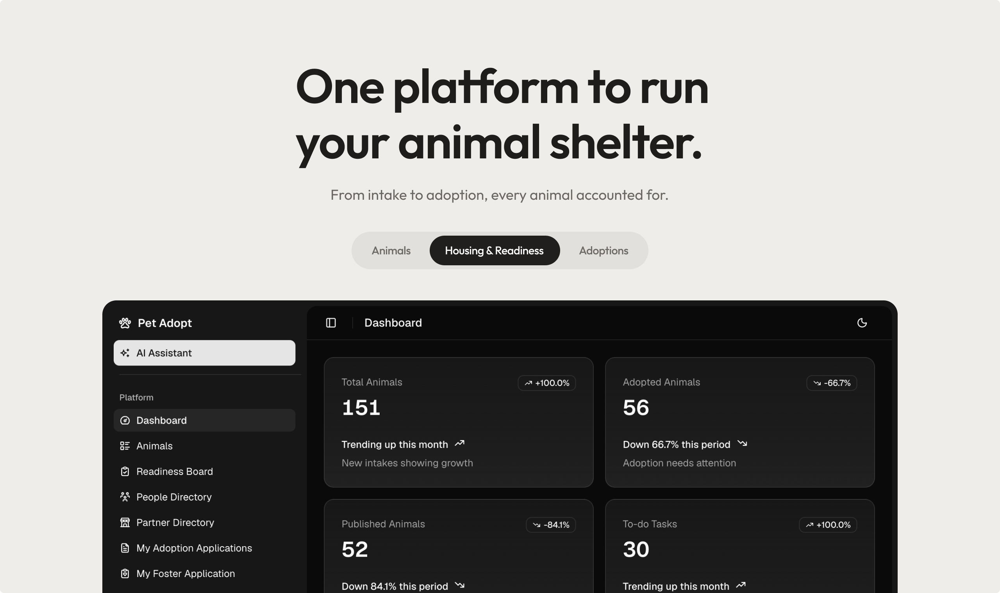

<p align="center">
  
</p>

<p align="center">
  <b><a href="https://animal-shelter-zeta.vercel.app/">🌐 Live Demo</a></b> | 
  <b><a href="docs/screenshots.md">📸 Screenshots</a></b> | 
  <b><a href="#getting-started">📖 Setup</a></b> | 
  <b><a href="contributing.md">🤝 Contributing</a></b>
</p>

---

This is an open-source, full-featured web application designed to be a comprehensive, end-to-end platform for animal shelters and rescue organizations. It moves beyond a simple pet listing site to provide a robust operational backbone for managing the entire lifecycle of an animal, from intake to outcome.

The platform features a public-facing portal for potential adopters and a powerful, permission-controlled dashboard for staff and volunteers to manage all aspects of shelter operations with a focus on data integrity and workflow automation.

## Core Features

The application is built around distinct, interconnected modules that handle the complex needs of a modern animal shelter.

### Animal Lifecycle Management

The system meticulously tracks an animal's entire journey through the shelter.

- **Intake Processing**: Handles various intake scenarios, including **owner surrenders**, **strays**, and **transfers** from partner organizations. It captures detailed information about the animal's origin and the people involved.
- **Re-Intake Workflow**: Provides a dedicated process for animals returning to the shelter. It automatically reactivates archived animal profiles, resets their status to `DRAFT`, and logs a new intake event, preserving the animal's complete history.
- **Outcome Management**: Manages all possible outcomes, including **adoptions**, **transfers out**, and **return-to-owner**. The system ensures data consistency with atomic operations. For example, processing an adoption:
  1.  Archives the animal's public profile.
  2.  Sets the appropriate `archiveReason` (e.g., `ADOPTED_INTERNAL`).
  3.  Updates the winning adoption application's status to `ADOPTED`.
  4.  **Automatically rejects all other open applications** for that animal, preventing conflicts and saving administrative time.

### Comprehensive Animal Profiles

Each animal has a rich, detailed profile that serves as the central hub for all its information. Staff can manage:

- **Core Details**: Update fundamental information like name, species, breed, age, weight, photos, and microchip number.
- **Characteristics Tagging**: Assign filterable tags (e.g., "Good with Kids," "Housebroken," "Heartworm Positive") to help match animals with suitable adopters. The system intelligently handles adding and removing tags in a single operation.
- **Dynamic Assessments**: Conduct standardized assessments (e.g., behavioral evaluations, medical intake exams) using **customizable templates**. The application dynamically generates forms and validation based on the selected template, ensuring consistent data collection.
- **Notes & History**: Add categorized notes (`BEHAVIORAL`, `MEDICAL`, `GENERAL`) to an animal's record. A full history of an animal's journey, status changes, and key events is logged automatically.
- **Task Management**: Create, assign, and track tasks related to a specific animal, such as "Administer medication," "Schedule vet visit," or "Behavioral follow-up." Tasks have statuses, priorities, and optional due dates.

### Adoption Application Workflow

The platform includes a complete system for managing adoption applications for both applicants and staff.

- **Public Application Portal**: Potential adopters can browse published animals, "like" their favorites, and submit detailed adoption applications directly through the platform.
- **Applicant Dashboard**: Applicants can view their submitted applications, edit them (if still pending), or withdraw them. They can also reactivate a previously withdrawn application if the animal becomes available again.
- **Staff Review & Management**: Staff have a dedicated dashboard to review and manage all incoming applications. Key features include:
  - **Status Management**: Update an application's status (`REVIEWING`, `APPROVED`, `REJECTED`, etc.) with a required reason for the change, creating a clear audit trail.
  - **Atomic Status Changes**: Approving an application automatically changes the animal's listing status to `PENDING_ADOPTION`, making it unavailable for new applications and preventing double-adoptions. If that application is later withdrawn or rejected, the system automatically makes the animal available again by setting its status back to `PUBLISHED`.
  - **Internal Notes**: Staff can add private notes to an application during the review process.

### User & Data Integrity

The system is built with security and data consistency as top priorities.

- **Role-Based Access Control (RBAC)**: Actions are protected by a permission system (`RequirePermission`). This ensures that only authorized users (e.g., `STAFF`, `ADMIN`) can perform sensitive operations like updating animal records or managing applications.
- **Transactional Integrity**: Critical multi-step database operations are wrapped in **Prisma transactions**. This guarantees that all steps in a process (like an adoption or intake) either complete successfully or fail together, preventing the database from ever being left in an inconsistent state.
- **Soft Deletes**: Important records like notes and assessments are soft-deleted rather than being permanently erased, preserving historical data for auditing and potential restoration.

## Tech Stack

### Core Stack

- **Framework**: [Next.js](https://nextjs.org/) (App Router)
- **Language**: [TypeScript](https://www.typescriptlang.org/)
- **Backend**: [Node.js](https://nodejs.org/)
- **Database**: [PostgreSQL](https://www.postgresql.org/)
- **File Storage**: [Vercel Blob](https://vercel.com/docs/vercel-blob/)
- **ORM**: [Prisma](https://www.prisma.io/)
- **Authentication**: [Better Auth](https://better-auth.com/)

### UI & Styling

- **Styling**: [Tailwind CSS](https://tailwindcss.com/)
- **Component Library**: [shadcn/ui](https://ui.shadcn.com/) (built on [Radix UI](https://www.radix-ui.com/))
- **Forms**: [React Hook Form](https://react-hook-form.com/) with [Zod](https://zod.dev/) for validation
- **Data Visualization**: [Recharts](https://recharts.org/)
- **File Uploads**: [Uppy](https://uppy.io/) with [Vercel Blob](https://vercel.com/storage/blob)
- **Containerization**: [Docker](https://www.docker.com/)

## Environment Variables

Add the following variables to your `.env` file. See `.env.example` for a full reference.

### Authentication

| Variable                     | Required    | Description                                                                                                           |
| ---------------------------- | ----------- | --------------------------------------------------------------------------------------------------------------------- |
| `BETTER_AUTH_SECRET`         | ✅ Required | Signs session cookies. [See generation instructions below.](#generating-better_auth_secret) Use a different value in each environment. |
| `BETTER_AUTH_ALLOWED_HOSTS`  | ✅ Required | Comma-separated allowlist of hosts the app may be served from. The host is read from the incoming request and matched against this list, which is what lets preview deployments work despite changing URLs. Hosts only — no scheme, no path. Supports exact matches, wildcards, and port wildcards (`localhost:*`). |
| `BETTER_AUTH_URL`            | ✅ Required | Fallback base URL, used when a request has no host to derive one from. Full URL with scheme, no trailing slash, and no `/api/auth` suffix — Better Auth appends its own base path. |
| `GITHUB_CLIENT_ID`           | ⚪ Optional | GitHub OAuth client ID, from your [GitHub Developer settings](https://github.com/settings/developers).                |
| `GITHUB_CLIENT_SECRET`       | ⚪ Optional | GitHub OAuth client secret, from your [GitHub Developer settings](https://github.com/settings/developers).            |
| `GOOGLE_CLIENT_ID`           | ⚪ Optional | Google OAuth client ID, from your [Google Cloud Console](https://console.cloud.google.com/apis/credentials).          |
| `GOOGLE_CLIENT_SECRET`       | ⚪ Optional | Google OAuth client secret, from your [Google Cloud Console](https://console.cloud.google.com/apis/credentials).      |
| `ADMIN_PASSWORD`             | ✅ Required | Password for the default admin user, used when seeding the database. Also the password for all other seeded accounts. |

Typical values per environment:

| Environment | `BETTER_AUTH_ALLOWED_HOSTS`                          | `BETTER_AUTH_URL`            |
| ----------- | ---------------------------------------------------- | ---------------------------- |
| Local       | `localhost:*`                                        | `http://localhost:3000`      |
| Preview     | `your-app-*-your-vercel-scope.vercel.app`            | your production URL          |
| Production  | `your-app.vercel.app`                                | `https://your-app.vercel.app`|

> **Keep preview host patterns scoped to your own Vercel team.** A bare `*.vercel.app` would trust every application on the platform, not just yours. Your Vercel scope suffix (visible in any preview URL) is the part nobody else can reproduce.

> **GitHub OAuth callback URL** — register `http://localhost:3000/api/auth/callback/github` on your OAuth App for local development. A GitHub OAuth App accepts only one callback URL, so use a separate OAuth App per environment. Preview deployments get a new URL per deploy, so GitHub sign-in does not work there; email and password sign-in does.

### Database

| Variable            | Required       | Description                                                                                                                                            |
| ------------------- | -------------- | ------------------------------------------------------------------------------------------------------------------------------------------------------ |
| `DATABASE_URL`      | ✅ Required    | Connection URL used by Prisma. For local dev, use your Docker values (see below). For production, replace with your provider's URL (e.g. Vercel/Neon). |
| `POSTGRES_USER`     | 🐳 Docker only | PostgreSQL username. Used by Docker Compose to initialize the container.                                                                               |
| `POSTGRES_PASSWORD` | 🐳 Docker only | PostgreSQL password. Used by Docker Compose to initialize the container.                                                                               |
| `POSTGRES_HOST`     | 🐳 Docker only | Set to `postgres` (the Docker Compose service name) for local dev.                                                                                     |
| `POSTGRES_DB`       | 🐳 Docker only | PostgreSQL database name. Used by Docker Compose to initialize the container.                                                                          |
| `POSTGRES_PORT`     | 🐳 Docker only | PostgreSQL port. Defaults to `5432`.                                                                                                                   |

### Storage

| Variable                | Required    | Description                                                      |
| ----------------------- | ----------- | ---------------------------------------------------------------- |
| `BLOB_READ_WRITE_TOKEN` | ✅ Required | Read/write token for Vercel Blob Storage (stores animal images). |

### Reporting

| Variable           | Required    | Description                                                                                                                                         |
| ------------------ | ----------- | ------------------------------------------------------------------------------------------------------------------------------------------------- |
| `SHELTER_TIMEZONE` | ⚪ Optional | IANA timezone the shelter operates in (e.g. `America/New_York`). All report date-range boundaries are computed in this zone. Defaults to `America/New_York`. |

### Seeding

| Variable              | Required    | Description                                                                                                                                                                                                    |
| ---------------------- | ----------- | ---------------------------------------------------------------------------------------------------------------------------------------------------------------------------------------------------------- |
| `SEED_IMAGE_BASE_URL` | ⚪ Optional | Base URL/path the seed uses for animal images. Read at seed time and baked into stored image paths. `/uploads` for local dev (default); a blob/CDN base URL for hosted deploys. Independent of the demo flag. Re-seed after changing it. |
| `DEV_LINK_TEST_EMAIL` | ⚪ Optional | Local development only. When set, gives one seeded walk-in person this email address, so signing in with an OAuth account whose verified email matches will exercise the account-to-person linking rule. Leave unset in any shared or deployed environment. |

### Generating `BETTER_AUTH_SECRET`

Run the following command to generate a secure secret key:

```bash
openssl rand -base64 32
```

Run it once per environment. A session cookie signed with one secret is valid anywhere that secret is used, so sharing a value between preview and production means a preview deployment can mint a valid production session.

- **macOS / Linux** — OpenSSL is usually pre-installed. Verify with `openssl version`.
- **Windows** — Install via the [OpenSSL website](https://www.openssl.org/) or Chocolatey: `choco install openssl`.

## Admin Dashboard Access

These credentials are created when you seed the database (`npx prisma db seed`, or `npm run db:reset` to reset and reseed in one step).

Sign-in supports email and password as well as GitHub OAuth. There is no self-serve registration — application accounts are created by seeding, or on first sign-in with GitHub.

### Admin

| Field    | Value                                                      |
| -------- | ---------------------------------------------------------- |
| Email    | `admin@example.com`                                        |
| Password | The value you set for `ADMIN_PASSWORD` in your `.env` file |

### Other Seeded Accounts

All non-admin accounts use the same password as `ADMIN_PASSWORD`.

| Email                      | Name            | Role      |
| -------------------------- | --------------- | --------- |
| `staff1@example.com`       | Olivia Chen     | Staff     |
| `staff2@example.com`       | Benjamin Carter | Staff     |
| `surrenderer1@example.com` | Jane Doe        | User      |
| `finder1@example.com`      | John Smith      | User      |
| `volunteer1@example.com`   | Sam Rivera      | Volunteer |

> **Live demo password:** `7dJbys5@?tMA`

## Getting Started

To run this project, you will need to have the following installed:

- [Node.js](https://nodejs.org/) (v22.22 or later — see `engines` in `package.json`)
- [Docker](https://www.docker.com/) and Docker Compose
- A free [Vercel](https://vercel.com/) account to use Vercel Blob for image storage.

### 1\. Initial Configuration

First, clone the repository and set up your environment variables.

1.  Clone the repository:

```sh
    git clone https://github.com/albdangarcia/animal-shelter.git
    cd animal-shelter
```

2.  Create your local environment file:

```sh
    cp .env.example .env
```

3.  **Fill out the `.env` file**:
    - Update the `POSTGRES_*` variables. The default values in `.env.example` are configured to work with the Docker setup below.
    - Set `ADMIN_PASSWORD` to a password of your choice. This will be the password for all seeded accounts.
    - Generate a `BETTER_AUTH_SECRET` by running `openssl rand -base64 32`.
    - Set `BETTER_AUTH_URL` to `http://localhost:3000` and leave `BETTER_AUTH_ALLOWED_HOSTS` as `localhost:*`.
    - Log into your Vercel account, create a new Blob store, and get your `BLOB_READ_WRITE_TOKEN`. **This is required for all image upload/delete functionality.**

## Running the App

You have two main options for running the application, depending on your goal.

### Option 1: Recommended Local Development (Docker)

This is the fastest way for contributors to get the application running on their local machine. This setup uses **Docker** to run the Next.js app and the PostgreSQL database, but still connects to **Vercel Blob** for image storage.

1.  Build and run the Docker containers:

    ```sh
    docker compose build
    docker compose up
    ```

2.  Open your browser and navigate to `http://localhost:3000`.

> #### ⚠️ **A Note on Local Image Seeding**
>
> The database seeding script (`npx prisma db seed`) will populate the database with sample animals whose images are served from the local `/public` folder. This is done to provide a quick visual setup without requiring you to upload dozens of images manually.
>
> - **Functionality:** You can view these seeded animals perfectly.
> - **Limitation:** You **cannot delete** a seeded animal's image through the dashboard, as it only exists locally and not in your Vercel Blob store. Any **new animals and images you create** through the application UI will be uploaded to Vercel Blob correctly and will be fully manageable.

### Option 2: Deploying on Vercel (Fully Serverless)

This method mirrors the live production environment. It's ideal for testing the full serverless architecture or deploying your own version of the platform.

1.  **Fork the Repository** on GitHub.
2.  **Create a New Vercel Project** and connect it to your forked repository.
3.  **Set up Vercel Integrations**:
    - Add the **Vercel Postgres** integration to create a serverless database.
    - Add the **Vercel Blob** integration for image storage.
4.  **Connect Environment Variables**: Vercel will automatically provide `POSTGRES_URL` and `BLOB_READ_WRITE_TOKEN` from the integrations. Copy these and all other variables from your `.env` file into the **Environment Variables** section of your Vercel project settings.
5.  **Set the auth variables per environment scope.** `BETTER_AUTH_SECRET` needs its own value in Production and in Preview — see the table in [Environment Variables](#environment-variables) for `BETTER_AUTH_ALLOWED_HOSTS` and `BETTER_AUTH_URL`. Preview deployments get a new URL per deploy, which is why the allowlist is a pattern rather than a single URL.
6.  **GitHub sign-in needs its own OAuth App per environment**, with that environment's `/api/auth/callback/github` registered on it. It will not work on preview deployments, since their URLs change per deploy; email and password sign-in is unaffected.
7.  **Deploy**: Trigger a new deployment on Vercel. Your application will be live.

## End-to-End Tests

Playwright is configured for a Chromium-only E2E workflow that mirrors the local Prisma setup without reusing your normal development database.

### What the Playwright setup does

- Starts an isolated PostgreSQL container from `docker-compose.playwright.yml`
- Overrides only auth/database-related environment variables for the E2E process
- Resets the database schema, runs `prisma db push`, and seeds data with `prisma/seed.ts`
- Starts the Next.js app on `http://127.0.0.1:3001`
- Runs a login smoke test using the seeded admin account (`admin@example.com`)

### Requirements

- Docker with `docker compose`
- A populated `.env` file with at least `BETTER_AUTH_SECRET`, `BETTER_AUTH_URL`, and `ADMIN_PASSWORD`

### Install the browser once

```sh
npm run e2e:install
```

### Run the E2E suite

```sh
npm run e2e
```

Optional local variants:

```sh
npm run e2e:headed
npm run e2e:ui
```


## Credits

Credit for the royalty-free images used in this project is given below:

- **Homepage dog image:** by [Brett Sayles](https://www.pexels.com/@brett-sayles/) (via Pexels)
- **All other pet images:** by [Pixabay](https://pixabay.com/)
- **Project logo (engraved rabbit):** Designed by macrovector / Freepik
